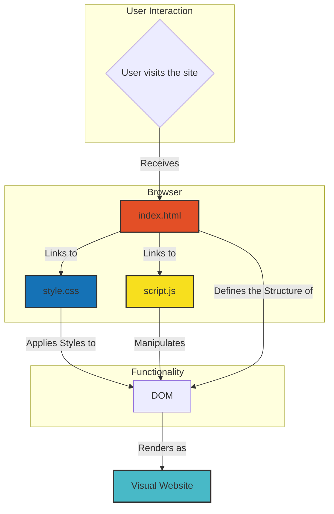
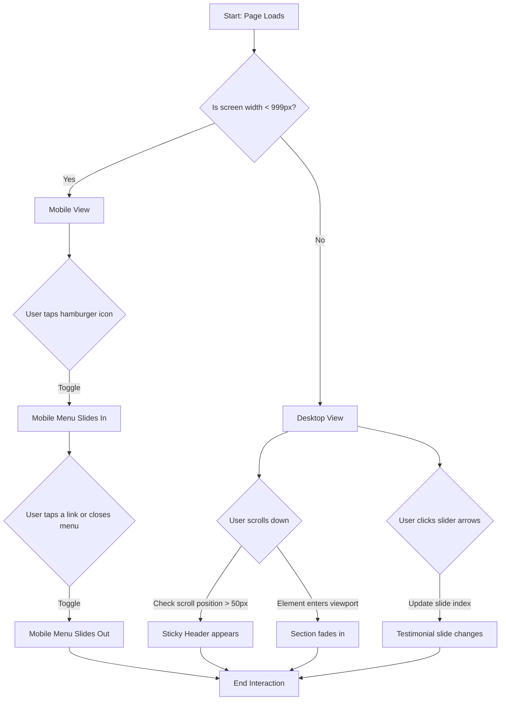

# Pop!_OS Website UI Clone


A fully responsive, pixel-perfect UI clone of the System76 Pop!_OS website, built from scratch with pure HTML, CSS, and vanilla JavaScript. This project focuses on modern frontend techniques without relying on any external frameworks.

**[▶️ View Live Demo](https://mdnm18.github.io/Pop-OS-offical-website-UI-clone/)**
---

## 📋 Table of Contents

- [About The Project](#about-the-project)
- [Tech Stack](#tech-stack)
- [Project Architecture](#project-architecture)
  - [File Structure](#file-structure)
  - [Architectural Diagram](#architectural-diagram)
  - [User Interaction Flowchart](#user-interaction-flowchart)
- [Key Features](#key-features)
- [Getting Started](#getting-started)
- [Contact](#contact)
- [Acknowledgements](#acknowledgements)

---

## 🚀 About The Project

This project is a comprehensive UI clone of the Pop!_OS landing page, developed as an exercise to demonstrate core frontend development skills. The primary goal was to turn a complex, professional design into a functional, elegant, and fully responsive solution using only fundamental web technologies.

The project emphasizes:
* **Semantic HTML5** for a well-structured and accessible foundation.
* **Modern CSS3**, including Flexbox, Grid, and Custom Variables for a maintainable and scalable stylesheet.
* **Vanilla JavaScript** for dynamic functionality, proving that powerful features can be built without dependency on heavy libraries.
* **A Mobile-First** responsive design workflow, ensuring a seamless experience on all devices.

---

## 🛠️ Tech Stack

This project was built using the following technologies:

* **HTML5:** For structuring the content and layout.
* **CSS3:** For all styling, layout, and animations.
    * **Flexbox:** For one-dimensional layout control (e.g., navigation bars, feature sections).
    * **Grid:** For two-dimensional layout control (e.g., card-based sections).
    * **Custom Variables:** For a centralized and maintainable theme (colors, fonts).
    * **Media Queries:** For building a fully responsive design.
* **Vanilla JavaScript:** For all interactive and dynamic features.
    * **DOM Manipulation:** To control classes and elements for interactivity.
    * **Intersection Observer API:** For performant scroll-based animations.

---

## 🏗️ Project Architecture

### File Structure

The project is organized into a clean and intuitive file structure:

```
pop-os-clone/
│
├── 📂 assets/
│   └── 📂 images/
│       ├── pop-hero-xl-night.jpg
│       ├── workflowrr.png.webp
│       ├── favicon.jpg
│       └── ... (all other images)
│
├── 📜 index.html        # The main HTML document
├── 🎨 style.css         # All CSS styles
└── ⚙️ script.js         # All JavaScript functionality
└── 📖 README.md         # Project documentation (this file)
```

### Architectural Diagram

This diagram illustrates the relationship between the core files and how they come together in the browser to deliver the final user experience.



### User Interaction Flowchart

This flowchart demonstrates the primary user flows and the logic handled by the CSS and JavaScript.



---

## ✨ Key Features

* **Fully Responsive:** Adapts seamlessly from small mobile screens to large desktop monitors.
* **Sticky Navigation:** The header sticks to the top of the page on scroll for easy access.
* **Functional Testimonial Slider:** A dynamic, auto-generating slider with arrow and dot navigation, built with Vanilla JS.
* **Smooth Scroll Animations:** Sections elegantly fade in as they enter the viewport, powered by the efficient Intersection Observer API.
* **Interactive Mobile Menu:** A functional slide-in navigation menu for smaller devices.
* **Pixel-Perfect Design:** A high-fidelity clone of the original site's layout, spacing, and typography.

---

## 🏁 Getting Started

To get a local copy up and running, follow these simple steps.

1.  **Clone the repository**
    ```sh
    git clone [https://github.com/mdnm18/Pop-OS-offical-website-UI-clone.git](https://github.com/mdnm18/Pop-OS-offical-website-UI-clone.git)
    ```
2.  **Navigate to the project directory**
    ```sh
    cd Pop-OS-offical-website-UI-clone
    ```
3.  **Open the `index.html` file** in your web browser to view the project.

---

## 📬 Contact

MD Nayaj Mondal

* **GitHub:** [github.com/mdnm18](https://github.com/mdnm18)
* **LinkedIn:** [linkedin.com/in/md-nayaj-mondal](https://www.linkedin.com/in/md-nayaj-mondal)
* **Portfolio:** [my-portfolio-website-eight-pi.vercel.app](https://my-portfolio-website-eight-pi.vercel.app/index.html)

---

## 🙏 Acknowledgements

* This project is a UI clone created for educational and demonstrative purposes.
* All original design, branding, and assets belong to **System76**.
* Original Website: [system76.com/pop](https://system76.com/pop)
