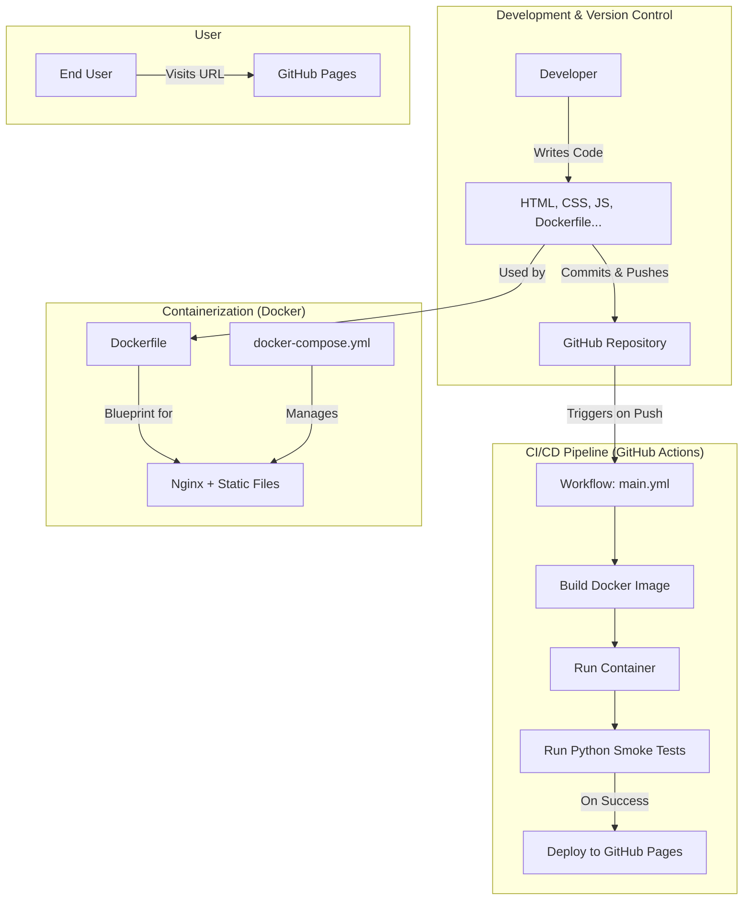
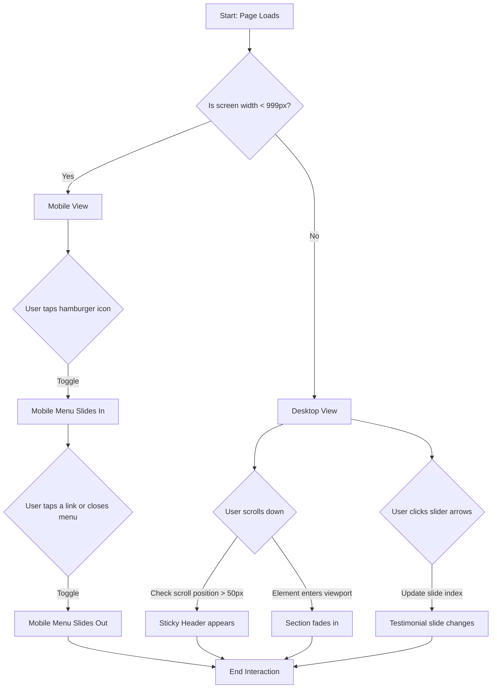

# Pop!_OS Website Clone & CI/CD Pipeline


A high-fidelity clone of the Pop!_OS website, containerized with Docker and automatically tested and deployed via a complete CI/CD pipeline using GitHub Actions. This project demonstrates an end-to-end modern development workflow, from coding the frontend to final deployment.

**[▶️ View Live Demo](https://mdnm18.github.io/Pop-OS-offical-website-UI-clone/)**

---

## 📋 Table of Contents

- [Project Overview & Objective](#-project-overview--objective)
- [Core Philosophy & Tech Stack Rationale](#-core-philosophy--tech-stack-rationale)
- [Project Architecture & System Design](#-project-architecture--system-design)
  - [File & Folder Structure](#file--folder-structure)
  - [Architectural Diagram](#architectural-diagram)
  - [User Interaction Flowchart](#user-interaction-flowchart)
- [Deep Dive: How Key Features Work Internally](#-deep-dive-how-key-features-work-internally)
  - [Responsive Design (Mobile-First)](#responsive-design-mobile-first)
  - [Sticky Header & Scroll Animations](#sticky-header--scroll-animations)
  - [Testimonial Slider](#testimonial-slider)
- [Containerization with Docker](#-containerization-with-docker)
  - [The Dockerfile](#the-dockerfile)
  - [Docker Compose](#docker-compose)
- [Automation with CI/CD (GitHub Actions)](#-automation-with-cicd-github-actions)
  - [The CI/CD Pipeline Explained](#the-cicd-pipeline-explained)
- [Getting Started](#-getting-started)
- [Future Enhancements & Scalability](#-future-enhancements--scalability)
- [Contact](#-contact)
- [Acknowledgements](#-acknowledgements)

---

## 🚀 Project Overview & Objective

This project is a comprehensive clone of the Pop!_OS landing page, developed as a skills assessment to showcase the ability to transform a complex, professional design into a functional, elegant, and maintainable web application.

The primary objective was to demonstrate a strong command of the entire modern development lifecycle:
1.  **Frontend Development:** Building a responsive UI with foundational technologies (HTML, CSS, JS) without framework abstractions.
2.  **Containerization:** Creating a portable and consistent application environment using Docker.
3.  **Automation & Deployment:** Implementing a full CI/CD pipeline with GitHub Actions to automatically test and deploy the application.

---

## 🧠 Core Philosophy & Tech Stack Rationale

The "vanilla" tech stack was a deliberate choice to highlight a deep understanding of the fundamentals.

* **Frontend: HTML5, CSS3, Vanilla JavaScript (ES6+)**
    * **Why?** To build a fast, lightweight, and dependency-free application. For a static landing page, frameworks like React or Vue introduce unnecessary overhead. Using vanilla technologies demonstrates a direct understanding of the DOM, browser APIs like the **Intersection Observer**, and modern CSS layouts.
    * **Alternatives Considered:** React/Vue. These are excellent for complex, state-driven apps but were deemed overkill for this project's scope.

* **Web Server: Nginx (via Docker)**
    * **Why?** Nginx is the industry standard for high-performance static content delivery. It's lightweight, fast, and secure, making it the perfect choice for serving our site in a production-like container.
    * **Alternatives Considered:** Apache (another capable web server, but Nginx is often preferred for its efficiency in this context) and Node.js/Express (unnecessary complexity for serving static files).

* **Containerization: Docker & Docker Compose**
    * **Why?** To solve the "it works on my machine" problem by packaging the application and its Nginx server into a single, portable container. This ensures a consistent environment for development, testing, and deployment. `docker-compose` simplifies local management.
    * **Alternatives Considered:** Running a server directly on the local machine. This is fine for quick development but lacks the consistency and production parity that Docker provides.

* **CI/CD: GitHub Actions**
    * **Why?** It's integrated directly into our repository, free for public projects, and configured with a simple YAML file. It keeps our entire workflow within the GitHub ecosystem.
    * **Alternatives Considered:** Jenkins (powerful but requires self-hosting and complex setup) and CircleCI (a great alternative, but GitHub Actions offers seamless integration).

---

## 🏗️ Project Architecture & System Design

We followed a **Simple Static Architecture** with a clear separation of concerns: Structure (HTML), Presentation (CSS), and Behavior (JS).

### File & Folder Structure

```
Pop-OS-offical-website-UI-clone/
│
├── .github/
│   └── workflows/
│       └── main.yml        # CI/CD pipeline definition
│
├── assets/
│   └── images/
│       └── ... (all images)
│
├── venv/                   # Local Python virtual environment (ignored by Git)
│
├── .gitignore              # Specifies files for Git to ignore
├── Dockerfile              # Blueprint to build the Docker image
├── docker-compose.yml      # Simplifies local Docker container management
├── index.html              # The main HTML document
├── README.md               # Project documentation
├── requirements.txt        # Python dependencies for testing
├── script.js               # All JavaScript functionality
├── style.css               # All CSS styles
└── test_app.py             # Automated smoke tests
```

### Architectural Diagram

This diagram shows the relationship between the project's components, from development to final deployment.



### User Interaction Flowchart

This flowchart demonstrates the primary user flows handled by the frontend.




---

## ✨ Deep Dive: How Key Features Work Internally

* **Responsive Design (Mobile-First):** The `style.css` is structured to apply base styles for small screens first. We then use `min-width` media queries to progressively enhance the layout for tablets and desktops, ensuring an optimal experience on any device.

* **Sticky Header & Scroll Animations:** A `scroll` event listener in `script.js` adds a `.scrolled` class to the header when the user scrolls down, triggering a CSS shadow. For animations, we use the **`IntersectionObserver` API**, a highly performant method to detect when an element is visible in the viewport, which then adds a class to trigger a smooth CSS fade-in transition.

* **Testimonial Slider:** This feature is powered entirely by Vanilla JS. It maintains a `currentSlide` index variable. Clicking the navigation buttons updates this index, and a function then modifies the CSS `transform: translateX()` property of the slide container, creating a smooth sliding animation.

---

## 🐳 Containerization with Docker

### The Dockerfile
The `Dockerfile` is a simple, three-step recipe:
1.  **`FROM nginx:alpine`**: Starts with an official, minimal Nginx web server image.
2.  **`COPY . /usr/share/nginx/html`**: Copies all project files (HTML, CSS, JS, assets) into the directory where Nginx serves files from.
3.  **`EXPOSE 80`**: Informs Docker that the container listens on port 80.

### Docker Compose
The `docker-compose.yml` file provides a shortcut for running the container. It defines a `web` service, tells it to build from our `Dockerfile`, and maps port `8080` on the host machine to port `80` in the container, allowing us to view the site at `http://localhost:8080`.

---

## 🤖 Automation with CI/CD (GitHub Actions)

The `main.yml` file automates our entire testing and deployment process.

### The CI/CD Pipeline Explained
The pipeline runs on every push to the `main` branch and consists of two sequential jobs:

1.  **`build-and-test` (Continuous Integration):**
    * Checks out the latest code.
    * **Installs Docker Compose**, which is a required dependency not included by default on the runner.
    * Builds the Docker image and runs the container in the background.
    * Sets up a Python environment and installs the testing libraries from `requirements.txt`.
    * **Runs the `test_app.py` smoke tests** against the live container. If any step fails, the workflow stops here.

2.  **`deploy` (Continuous Deployment):**
    * This job only starts if `build-and-test` succeeds.
    * It uses official GitHub Actions to configure and deploy the static files from the repository directly to GitHub Pages.
    * The result is that every successfully tested push to `main` is automatically reflected on the live demo URL.

---

## 🏁 Getting Started

To get a local copy up and running using Docker:

1.  **Prerequisites:** Make sure you have [Docker Desktop](https://www.docker.com/products/docker-desktop/) installed and running.

2.  **Clone the repository**
    ```sh
    git clone [https://github.com/mdnm18/Pop-OS-offical-website-UI-clone.git](https://github.com/mdnm18/Pop-OS-offical-website-UI-clone.git)
    ```
3.  **Navigate to the project directory**
    ```sh
    cd Pop-OS-offical-website-UI-clone
    ```
4.  **Build and run the container**
    ```sh
    docker-compose up --build
    ```
5.  **Open your web browser** and navigate to `http://localhost:8080` to view the project.

---

## 🔮 Future Enhancements & Scalability

* **Stability & Reliability:** Implement a more robust end-to-end testing suite using a tool like **Playwright** or **Cypress** to simulate real user interactions and catch more subtle bugs.
* **Performance Optimization:** Add a build step to the CI/CD pipeline to automatically minify CSS/JS and optimize images, further improving load times.
* **Componentization:** For a larger application, the UI could be broken down into reusable components using a static site generator or JS template literals.
* **Headless CMS Integration:** The content for features and testimonials could be managed via a headless CMS to allow for updates without changing the code.

---

## 📬 Contact

MD Nayaj Mondal

* **GitHub:** [github.com/mdnm18](https://github.com/mdnm18)
* **LinkedIn:** [linkedin.com/in/md-nayaj-mondal](https://www.linkedin.com/in/md-nayaj-mondal)
* **Portfolio:** [my-portfolio-website-eight-pi.vercel.app](https://my-portfolio-website-eight-pi.vercel.app/index.html)

---

## 🙏 Acknowledgements

* This project is a clone created for educational and demonstrative purposes.
* All original design, branding, and assets belong to **System76**.
* Original Website: [system76.com/pop](https://system76.com/pop)
